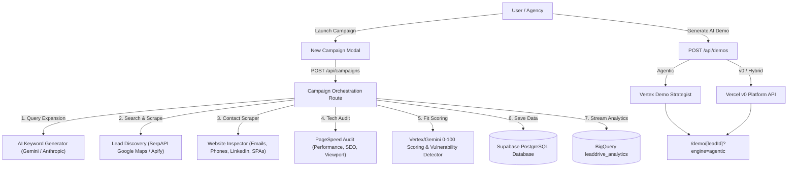

# ⚡ LeadDrive — AI-Powered Cold Outreach & Demo Automation Platform

**LeadDrive** is an end-to-end cold outreach automation engine designed for digital agencies, software consultancies, and freelancers. It discovers real business prospects, expands search with Vertex/Gemini, audits digital presence, generates personalized demos with **Agentic**, **v0**, or **Hybrid** engines, and streams outreach analytics to Supabase and BigQuery.

---

## 🌟 Key Features & Capability Matrix

| Capability | Description | Powered By |
|------------|-------------|------------|
| **Multi-Keyword Query Expansion** | Expands target audience & location into 4 discovery strategy pillars (timeline `2026`, sub-niche `SaaS`, registries/directories, commercial intent) | Gemini / Anthropic / Algorithmic Engine |
| **Lead Discovery Engine** | Real-time business prospect discovery from Google Maps, LinkedIn, Apollo, Product Hunt, URLs, or CSV lists | SerpAPI & Apify |
| **Website & Contact Scraper** | Fetches website HTML, extracts `mailto:` emails, `tel:` phones, `linkedin.com/company` profiles, and detects SPA frameworks | Node Fetch & HTML Parser |
| **Technical & PageSpeed Audit** | Evaluates mobile performance, SEO, accessibility, and best practices with automated snapshot estimation fallback | Google PageSpeed API |
| **Scalable Demo Engine** | Choose credit-safe Agentic blueprints, live v0 sites, or Hybrid Vertex strategy + v0 execution with campaign caps | Vertex AI + Vercel v0 |
| **AI Provider System** | Choose Vertex AI Gemini 2.5 Flash with Search Grounding, Google Gemini API, or Anthropic Claude | Vertex AI / Google AI / Anthropic |
| **Outreach Delivery & Tracking** | Sends email/SMS outreach, tracks opens/clicks, and streams events to analytics | Resend, Twilio, Supabase, BigQuery |

---

## 🏗️ Architecture & Pipeline Flow



---

## 🚀 Quick Start & Installation

### 1. Prerequisites
- **Node.js**: v18.0.0 or higher
- **pnpm**: v8.0.0 or higher

### 2. Clone & Install
```bash
git clone https://github.com/irfankhan2213/leaddrive.git
cd leaddrive
pnpm install
```

### 3. Setup Environment Variables
Copy `.env.example` to `.env.local`:
```bash
cp .env.example .env.local
```

Fill `.env.local` with your API keys:
```bash
# Core Application URL
APP_BASE_URL="http://localhost:3000"

# Database Persistence (Supabase)
NEXT_PUBLIC_SUPABASE_URL="https://your-supabase-project.supabase.co"
NEXT_PUBLIC_SUPABASE_PUBLISHABLE_KEY="your_supabase_anon_key"
SUPABASE_SERVICE_ROLE_KEY="your_supabase_service_role_key"

# AI Discovery & Lead Analysis
GEMINI_API_KEY="your_gemini_api_key"
GEMINI_ENABLED="true"
GEMINI_MODEL="gemini-2.5-flash"

ANTHROPIC_API_KEY="your_anthropic_api_key"
ANTHROPIC_ENABLED="true"

# Search Discovery Engines
SERPAPI_KEY="your_serpapi_key"
APIFY_TOKEN="your_apify_token"
APIFY_ACTOR_ID="your_apify_actor_id"

# Technical Auditing
PAGESPEED_API_KEY="your_pagespeed_api_key"

# Vercel v0 AI Site Builder
V0_API_KEY="your_v0_api_key"
V0_MODEL="v0-mini"

# Google Cloud Vertex AI + BigQuery
GCP_PROJECT_ID="your-gcp-project-id"
GCP_LOCATION="us-central1"
GOOGLE_APPLICATION_CREDENTIALS="./gcp-service-account.json"
VERTEX_AI_ENABLED="true"
VERTEX_AI_MODEL="gemini-2.5-flash"
VERTEX_SEARCH_GROUNDING="true"
BIGQUERY_ENABLED="true"
BIGQUERY_DATASET="leaddrive_analytics"

# Cold Outreach Delivery
RESEND_API_KEY="your_resend_api_key"
FROM_EMAIL="outreach@yourdomain.com"
FROM_NAME="LeadDrive Specialist"
```

### 4. Run Database Schema Migration
Open your **Supabase SQL Editor** and execute the contents of [supabase/schema.sql](file:///Users/irfan/Desktop/leaddrive/supabase/schema.sql).

### 5. Start Development Server
```bash
pnpm dev
```
Open [http://localhost:3000](http://localhost:3000) in your browser.

---

## 📡 API Reference

### 1. Campaigns & Pipeline
- `GET /api/campaigns`: Retrieves all campaigns and scraped leads from Supabase.
- `POST /api/campaigns`: Launches multi-keyword search query expansions, scrapes target prospects via SerpAPI/Apify, runs website contact scraping & PageSpeed audits, scores leads (0-100), and persists campaign records.

### 2. Scalable Demo Building
- `POST /api/demos`: Builds demos with `demoProvider: "agentic" | "v0" | "hybrid"`.
- Agentic mode uses Vertex AI to create a conversion blueprint with no v0 spend.
- v0 mode builds live hosted Next.js/Tailwind demos through the v0 Platform API.
- Hybrid mode uses Vertex to plan the demo and v0 to build the live page.
- Campaign auto-generation is off by default and guarded by `demoLimit` plus `demoMinScore`.

### 3. Outreach & Email Delivery
- `POST /api/outreach`: Sends tailored cold outreach emails via Resend API with open-tracking pixels and click-tracking links.

### 4. Tracking Pixels & Analytics
- `GET /api/track/open?leadId=...`: 1x1 transparent GIF endpoint recording email opens.
- `GET /api/track/click?leadId=...&target=...`: Validates redirect URLs and records click events.
- BigQuery streaming records leads plus sent/opened/clicked outreach events when enabled.

### 5. Health & Diagnostic Check
- `GET /api/health?live=1`: Checks Supabase, Vertex AI, BigQuery schema, Gemini, and v0 reachability.

---

## 🛡️ Security & SSRF Protection

- **SSRF Hardening**: Website scraping (`lib/website.ts`) validates URL schemes (`http`/`https`) and strictly blocks private IP ranges (`127.0.0.1`, `10.x`, `192.168.x`, `169.254.x`) and internal hostnames.
- **Open Redirect Protection**: Click-tracking redirect validation (`lib/track/click`) sanitizes target destinations to prevent backslash bypass tricks and open redirects.
- **Database Row Level Security**: Supabase tables enforce RLS policies and restrict `service_role` operations.

---

## 📄 License & Credits

Built with ❤️ by the LeadDrive team using Next.js, Supabase, Tailwind CSS, Google Gemini, Anthropic Claude, and Vercel v0.
