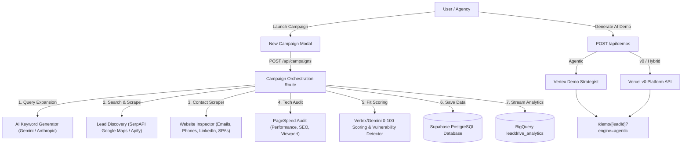

# ⚡ LeadDrive — AI-Powered Cold Outreach & Demo Automation Platform

**LeadDrive** is an end-to-end cold outreach automation engine designed for digital agencies, software consultancies, and freelancers. It discovers real business prospects, expands search with Vertex/Gemini, audits digital presence, generates personalized demos with **Vercel v0**, and streams outreach analytics to Supabase and BigQuery.

> **Security model:** every `/api/*` route except tracking pixels and one-click unsubscribe requires an authenticated Supabase session; all database access is scoped by `user_id` and enforced with row-level security. Provider credentials are stored server-side per user and are never sent to or held by the browser.

---

## 🌟 Key Features & Capability Matrix

| Capability | Description | Powered By |
|------------|-------------|------------|
| **Multi-Keyword Query Expansion** | Expands target audience & location into discovery queries (timeline, sub-niche, registries/directories, commercial intent) | Vertex AI / Gemini / Anthropic / Algorithmic fallback |
| **Lead Discovery Engine** | Real-time business prospect discovery from Google Maps, Instagram, LinkedIn-style sources, Product Hunt, URLs, or CSV lists | SerpAPI & Apify |
| **Website & Contact Scraper** | Fetches website HTML (SSRF-guarded), extracts `mailto:` emails, `tel:` phones, `linkedin.com/company` profiles, and detects SPA frameworks | Node Fetch & HTML Parser |
| **Technical & PageSpeed Audit** | Evaluates mobile performance, SEO, accessibility, and best practices | Google PageSpeed API |
| **Scalable Demo Engine** | Builds live hosted Next.js/Tailwind demos via the Vercel v0 Platform API with multi-key failover, campaign caps (`demoLimit`, `demoMinScore`) | Vercel v0 |
| **AI Provider System** | Choose Vertex AI Gemini with Search Grounding, Google Gemini API, or Anthropic Claude for keyword expansion and lead scoring | Vertex AI / Google AI / Anthropic |
| **Outreach Delivery & Tracking** | Sends email/SMS outreach with signed one-click unsubscribe + suppression enforcement, tracks opens/clicks, streams events to analytics | Resend, Twilio, Supabase, BigQuery |

---

## 🏗️ Architecture & Pipeline Flow



---

## 🚀 Quick Start & Installation

### 1. Prerequisites
- **Node.js**: v18.0.0 or higher
- **pnpm**: v8.0.0 or higher

### 2. Clone & Install
```bash
git clone https://github.com/irfankhan2213/leaddrive.git
cd leaddrive
pnpm install
```

### 3. Setup Environment Variables
Copy `.env.example` to `.env.local`:
```bash
cp .env.example .env.local
```

Fill `.env.local` with your API keys:
```bash
# Core Application URL
APP_BASE_URL="http://localhost:3000"

# Database Persistence (Supabase)
NEXT_PUBLIC_SUPABASE_URL="https://your-supabase-project.supabase.co"
NEXT_PUBLIC_SUPABASE_PUBLISHABLE_KEY="your_supabase_anon_key"
SUPABASE_SERVICE_ROLE_KEY="your_supabase_service_role_key"

# Signed one-click unsubscribe links (openssl rand -hex 32)
UNSUBSCRIBE_SECRET="your_random_hex_secret"

# Health check token for full /api/health?live=1 diagnostics
HEALTH_CHECK_TOKEN="your_health_token"

# AI Discovery & Lead Analysis
GEMINI_API_KEY="your_gemini_api_key"
GEMINI_ENABLED="true"
GEMINI_MODEL="gemini-2.5-flash"

ANTHROPIC_API_KEY="your_anthropic_api_key"
ANTHROPIC_ENABLED="true"

# Search Discovery Engines
SERPAPI_KEY="your_serpapi_key"
APIFY_TOKEN="your_apify_token"
APIFY_ACTOR_ID="your_apify_actor_id"

# Technical Auditing
PAGESPEED_API_KEY="your_pagespeed_api_key"

# Vercel v0 AI Site Builder (optional backup keys for failover)
V0_API_KEY="your_v0_api_key"
V0_BACKUP_API_KEYS=""
V0_MODEL="v0-mini"

# Google Cloud Vertex AI + BigQuery
GCP_PROJECT_ID="your-gcp-project-id"
GCP_LOCATION="us-central1"
GOOGLE_APPLICATION_CREDENTIALS="./gcp-service-account.json"
VERTEX_AI_ENABLED="true"
VERTEX_AI_MODEL="gemini-2.5-flash"
VERTEX_SEARCH_GROUNDING="true"
BIGQUERY_ENABLED="true"
BIGQUERY_DATASET="leaddrive_analytics"

# Cold Outreach Delivery
RESEND_API_KEY="your_resend_api_key"
FROM_EMAIL="outreach@yourdomain.com"
FROM_NAME="LeadDrive Specialist"
```

### 4. Run Database Schema Migration
Open your **Supabase SQL Editor** and execute the contents of [supabase/schema.sql](file:///Users/irfan/Desktop/leaddrive/supabase/schema.sql).

### 5. Start Development Server
```bash
pnpm dev
```
Open [http://localhost:3000](http://localhost:3000) in your browser.

---

## 📡 API Reference

All routes below require an authenticated session (Supabase cookie), except the tracking endpoints and unsubscribe link, which are public but rate-limited and signed where applicable.

### 0. Settings
- `GET /api/settings`: Returns the caller's settings with secret fields stripped and a `configured` map of which credentials are set.
- `PUT /api/settings`: Persists settings server-side. Secret fields are write-only — submitting an empty value keeps the stored credential.

### 1. Campaigns & Pipeline
- `GET /api/campaigns`: Retrieves the caller's campaigns and leads from Supabase.
- `POST /api/campaigns`: Launches keyword expansion, scrapes prospects via SerpAPI/Apify, runs website contact scraping & PageSpeed audits, scores leads, and persists records owned by the caller. The campaign row is created up-front so a mid-pipeline failure never loses the record. Rate limited to 10 launches/min. Lead count per campaign is capped at 100.

### 2. Scalable Demo Building
- `POST /api/demos`: Builds live v0 demos for DB-owned leads (`{ lead: { id } }` or `{ leadIds: [...] }`, capped at 25/request). Leads are loaded and ownership-verified server-side; client payloads are never trusted.

### 3. Outreach & Email Delivery
- `POST /api/outreach`: Sends tailored cold outreach by saved `leadId` via Resend/Twilio with open-tracking pixels, click-tracking links, and a signed one-click unsubscribe footer. Suppressed (opted-out) leads are rejected with HTTP 409. Rate limited to 30/min.
- `POST /api/outreach/batch`: Same as above for up to 100 saved `leadIds`; suppressed contacts are skipped automatically. Rate limited to 6/min.

### 4. Tracking Pixels & Analytics
- `GET /api/track/open?leadId=...`: 1x1 transparent GIF recording email opens (deduplicated to one event per lead/day).
- `GET /api/track/click?leadId=...&target=...`: Validates redirect URLs against an exact-host allowlist and records click events (deduplicated per day).
- BigQuery streaming records leads plus sent/opened/clicked outreach events when enabled.

### 5. Unsubscribe (compliance)
- `GET /api/unsubscribe?leadId=...&sig=...`: Signed one-click opt-out. Marks the lead `suppressed` — every future single or batch send checks this flag server-side before dispatching.

### 6. Health & Diagnostic Check
- `GET /api/health`: Public liveness probe returning `{ app: "ok" }`.
- `GET /api/health?live=1` + header `x-health-token: $HEALTH_CHECK_TOKEN`: Full diagnostics for Supabase, Vertex AI, BigQuery schema, Gemini, and v0 reachability.

---

## 🛡️ Security & SSRF Protection

- **Authentication**: All mutating API routes verify the Supabase session server-side and operate through a user-scoped client; row-level security restricts every read/write to rows owned by the caller.
- **Server-side secrets**: Provider API keys are stored in the `app_settings` table and resolved at request time on the server. They are never returned to the browser (write-only fields) and never accepted from request bodies.
- **SSRF Hardening**: Website scraping (`lib/website.ts`) validates URL schemes (`http`/`https`) and strictly blocks private IP ranges (`127.0.0.1`, `10.x`, `192.168.x`, `169.254.x`) and internal hostnames.
- **Open Redirect Protection**: Click-tracking redirects validate targets against an exact-host allowlist (with dot-boundary matching) to prevent suffix-spoofing domains like `evilv0.dev`.
- **Rate Limiting**: Cost-bearing endpoints (campaigns, demos, outreach, batch sends) are rate-limited per IP; tracking pixels are throttled and deduplicated to prevent analytics inflation.
- **Database Row Level Security**: Supabase tables enforce strict per-user RLS policies; `service_role` operations are reserved for system tasks (tracking pixels, unsubscribe).

---

## 📄 License & Credits

Built with ❤️ by the LeadDrive team using Next.js, Supabase, Tailwind CSS, Google Gemini, Anthropic Claude, and Vercel v0.
